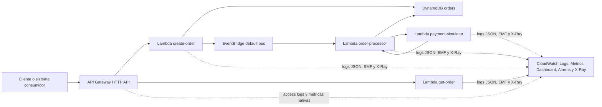
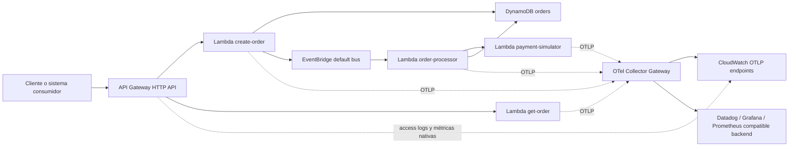

# Observability Business Case

Caso base para talleres técnicos senior sobre arquitectura serverless, resiliencia y observabilidad. Esta iteración mantiene el flujo funcional de procesamiento de órdenes y reemplaza la infraestructura SAM por Terraform para simplificar CI/CD y el control del estado de la infraestructura.

## Arquitectura

- Amazon API Gateway HTTP API expone `POST /orders` y `GET /orders/{orderId}`.
- Lambda `create-order` valida el payload, calcula `totalAmount`, persiste la orden en DynamoDB con estado `PENDING` y publica `OrderCreated` en EventBridge.
- Lambda `order-processor` consume el evento, mueve la orden a `PROCESSING`, invoca sincrónicamente al simulador de pago y actualiza el estado final.
- Lambda `payment-simulator` simula pagos con modos configurables para escenarios de falla.
- DynamoDB almacena el estado y atributos de la orden.
- CloudWatch Logs concentra logs JSON de cada Lambda y access logs del API.
- CloudWatch Metrics recibe métricas custom vía Embedded Metric Format (EMF) sin librerías adicionales.
- AWS X-Ray queda habilitado en las Lambdas para ver latencia y errores por función.
- La base de instrumentación compartida vive en `src/shared/observability.js` y la convención del repositorio es `otel-first`, preservando compatibilidad temporal con EMF para CloudWatch.



### Arquitectura objetivo OTLP con Collector



## Observabilidad implementada

- Correlación end-to-end con `x-correlation-id`, `requestId`, `awsRequestId` y `orderId`.
- Propagación de `correlationId` desde `POST /orders` hacia EventBridge, `order-processor` y `payment-simulator`.
- Base de instrumentación OpenTelemetry en código, compatible con ADOT Lambda layer y con exporters OTLP cuando se configuren.
- Estrategia recomendada de salida OTLP: `Collector primero`, para desacoplar la instrumentación del backend final.
- Logs JSON consistentes por servicio con contexto reutilizable.
- Métricas EMF para creación de órdenes, lecturas, órdenes procesadas, errores y latencia del simulador de pago.
- Retención explícita de CloudWatch Logs configurable desde Terraform.
- Access logs para API Gateway HTTP API.
- Dashboard de CloudWatch con métricas técnicas y de negocio.
- Alarmas básicas para 5xx del API, errores del procesador y latencia del simulador de pago.

Nota: esta solución usa API Gateway HTTP API. Esa variante no soporta tracing activo con X-Ray como sí ocurre con REST API, así que el API se observa mediante access logs; el tracing queda habilitado en las Lambdas.

## Estructura

```text
.
├── README.md
├── package.json
├── infra
│   └── terraform
│       ├── main.tf
│       ├── outputs.tf
│       └── variables.tf
├── scripts
│   ├── create-order.sh
│   ├── generate-load.sh
│   ├── get-order.sh
│   └── prepare-lambda-package.sh
└── src
    ├── order-api
    ├── order-processor
    ├── payment-simulator
    └── shared
```

## Requisitos

- Node.js 20.x
- Terraform CLI 1.6 o superior
- AWS CLI configurado con credenciales válidas

## Variables de despliegue

Lee esta sección en este orden:

1. Variables base del stack
2. Variables de observabilidad
3. Variables de alarmas y dashboard
4. Variables de estado remoto

### 1. Variables base del stack

| Variable | Valores permitidos | Obligatoria | Significado | Recomendado |
| :--- | :--- | :--- | :--- | :--- |
| `STACK_NAME` | cualquier string válido para nombres de recursos AWS | Sí | Nombre lógico del stack | `observability-business-case` |
| `RESOURCE_PREFIX` | cualquier string válido para prefijo | Sí | Prefijo para separar ambientes o tenants | `aws-dev` |
| `AWS_REGION` | una región AWS válida | Sí | Región donde se crea la infraestructura | `us-east-1` |
| `PAYMENT_FAILURE_MODE` | `none`, `always_fail`, `random_fail`, `slow_response`, `random_reject` | Sí | Define cómo se comporta la Lambda `payment-simulator` durante demos y pruebas | `none` |
| `LOG_RETENTION_IN_DAYS` | número entero positivo | No | Días de retención para CloudWatch Logs | `7` |
| `METRICS_NAMESPACE` | cualquier string | No | Namespace de métricas EMF mientras siga activa la compatibilidad con CloudWatch Metrics clásico | `Workshop/OrderProcessing` |

### 2. Variables de observabilidad

Primero define **quién inicializa OTel** y luego **a dónde exporta**.

#### 2.1 Quién inicializa OpenTelemetry

| Variable | Valores permitidos | Obligatoria | Significado | Recomendado |
| :--- | :--- | :--- | :--- | :--- |
| `OTEL_MODE` | `code`, `adot_layer` | Sí | Decide si el SDK OTel arranca dentro del código de la app o desde un Lambda Layer ADOT | `code` |
| `ADOT_LAMBDA_LAYER_ARN` | ARN de Lambda Layer o vacío | Solo si `OTEL_MODE=adot_layer` | ARN del layer ADOT que inicializa OTel fuera del código | vacío |

Significado de `OTEL_MODE`:

- `code`: la app usa [otel-bootstrap.js](/Users/pazfernando/Documents/projects/windsurf/workshop-order-processing/src/shared/otel-bootstrap.js:1) para iniciar OTel en proceso.
- `adot_layer`: Terraform adjunta un Lambda Layer ADOT y define `AWS_LAMBDA_EXEC_WRAPPER=/opt/otel-handler`.

#### 2.2 A dónde exporta OpenTelemetry

| Variable | Valores permitidos | Obligatoria | Significado | Recomendado |
| :--- | :--- | :--- | :--- | :--- |
| `OTEL_EXPORT_STRATEGY` | `direct`, `collector` | Sí | Define si las Lambdas envían OTLP directo al backend final o primero a un Collector | `direct` hoy |
| `OTEL_EXPORTER_OTLP_ENDPOINT` | URL OTLP válida o vacío | Solo si `OTEL_EXPORT_STRATEGY=direct` | Endpoint base OTLP del backend final | vacío |
| `OTEL_EXPORTER_OTLP_TRACES_ENDPOINT` | URL OTLP válida o vacío | No | Override de trazas para modo `direct` | vacío |
| `OTEL_EXPORTER_OTLP_METRICS_ENDPOINT` | URL OTLP válida o vacío | No | Override de métricas para modo `direct` | vacío |
| `OTEL_COLLECTOR_ENDPOINT` | URL OTLP válida o vacío | Solo si `OTEL_EXPORT_STRATEGY=collector` | Endpoint base del Collector | vacío hasta que exista Collector |
| `OTEL_COLLECTOR_TRACES_ENDPOINT` | URL OTLP válida o vacío | No | Override de trazas para modo `collector` | vacío |
| `OTEL_COLLECTOR_METRICS_ENDPOINT` | URL OTLP válida o vacío | No | Override de métricas para modo `collector` | vacío |

Significado de `OTEL_EXPORT_STRATEGY`:

- `direct`: la app exporta OTLP directo a CloudWatch OTLP o a un tercero.
- `collector`: la app exporta OTLP a un Collector, y el Collector decide si reenvía a CloudWatch, Datadog, Grafana, Prometheus u otros.

Reglas prácticas:

- Si usas `direct`, normalmente solo defines `OTEL_EXPORTER_OTLP_ENDPOINT`.
- Si usas `collector`, normalmente solo defines `OTEL_COLLECTOR_ENDPOINT`.
- Los endpoints específicos de trazas y métricas se usan solo si necesitas rutas distintas.

#### 2.3 Compatibilidad temporal y tuning

| Variable | Valores permitidos | Obligatoria | Significado | Recomendado |
| :--- | :--- | :--- | :--- | :--- |
| `OBSERVABILITY_EMF_COMPATIBILITY_MODE` | `true`, `false` | No | Mantiene emisión EMF en paralelo mientras migras a OTel | `true` |
| `OTEL_METRIC_EXPORT_INTERVAL_MS` | entero positivo | No | Intervalo de exportación de métricas OTel desde la app | `10000` |

Variables que normalmente no debes tocar a mano:

- `OBSERVABILITY_OTEL_ENABLED`: Terraform la deriva desde `OTEL_MODE`.
- `OTEL_SERVICE_NAME`: Terraform la define por Lambda.

### 3. Variables de alarmas y dashboard

| Variable | Valores permitidos | Obligatoria | Significado | Recomendado |
| :--- | :--- | :--- | :--- | :--- |
| `CREATE_OBSERVABILITY_DASHBOARD` | `true`, `false` | No | Crea el dashboard de CloudWatch | `true` |
| `CREATE_OBSERVABILITY_ALARMS` | `true`, `false` | No | Crea alarmas base de operación | `true` |
| `API_5XX_ALARM_THRESHOLD` | número entero no negativo | No | Umbral por minuto para respuestas 5xx del API | `1` |
| `ORDER_PROCESSOR_ERROR_ALARM_THRESHOLD` | número entero no negativo | No | Umbral por minuto para errores del `order-processor` | `1` |
| `PAYMENT_LATENCY_ALARM_THRESHOLD_MS` | número entero no negativo | No | Umbral promedio de latencia del simulador de pago | `3000` |

### 4. Variables de estado remoto de Terraform

| Variable | Valores permitidos | Obligatoria | Significado | Recomendado |
| :--- | :--- | :--- | :--- | :--- |
| `TF_STATE_BUCKET` | nombre de bucket S3 o vacío | No | Bucket del backend remoto de Terraform | vacío si el workflow lo crea |
| `TF_STATE_KEY` | path/key de S3 o vacío | No | Key del estado remoto | `${environment}/${STACK_NAME}.tfstate` |

### Configuraciones recomendadas por caso

#### Caso A: valor por defecto operativo del repo

Usa este caso si todavía no tienes Collector ni backend OTLP confirmado.

| Variable | Valor |
| :--- | :--- |
| `OTEL_MODE` | `code` |
| `OTEL_EXPORT_STRATEGY` | `direct` |
| `OTEL_EXPORTER_OTLP_ENDPOINT` | vacío o endpoint directo si ya existe |
| `OBSERVABILITY_EMF_COMPATIBILITY_MODE` | `true` |

#### Caso B: exportación directa a backend OTLP

Usa este caso si enviarás OTel directo a CloudWatch OTLP o a un vendor.

| Variable | Valor |
| :--- | :--- |
| `OTEL_MODE` | `code` |
| `OTEL_EXPORT_STRATEGY` | `direct` |
| `OTEL_EXPORTER_OTLP_ENDPOINT` | `https://...` |
| `OBSERVABILITY_EMF_COMPATIBILITY_MODE` | `true` |

#### Caso C: arquitectura objetivo con Collector

Usa este caso solo cuando ya existe un Collector accesible desde las Lambdas.

| Variable | Valor |
| :--- | :--- |
| `OTEL_MODE` | `code` |
| `OTEL_EXPORT_STRATEGY` | `collector` |
| `OTEL_COLLECTOR_ENDPOINT` | `http://collector.internal:4318` |
| `OBSERVABILITY_EMF_COMPATIBILITY_MODE` | `true` |

#### Caso D: ADOT Layer + Collector

Usa este caso cuando quieras que el bootstrap de OTel quede fuera del código.

| Variable | Valor |
| :--- | :--- |
| `OTEL_MODE` | `adot_layer` |
| `ADOT_LAMBDA_LAYER_ARN` | `arn:aws:lambda:...:layer:...` |
| `OTEL_EXPORT_STRATEGY` | `collector` |
| `OTEL_COLLECTOR_ENDPOINT` | `http://collector.internal:4318` |

## Despliegue local

### 1. Configurar credenciales AWS

Puedes usar AWS CLI:

```bash
aws configure
```

O variables de entorno:

```bash
export AWS_ACCESS_KEY_ID="<tu-access-key-id>"
export AWS_SECRET_ACCESS_KEY="<tu-secret-access-key>"
export AWS_REGION="us-east-1"
```

### 2. Configurar variables de despliegue

```bash
export STACK_NAME="observability-business-case"
export RESOURCE_PREFIX="aws-dev"
export AWS_REGION="us-east-1"
export PAYMENT_FAILURE_MODE="none"
export LOG_RETENTION_IN_DAYS="7"
export METRICS_NAMESPACE="Workshop/OrderProcessing"
export OTEL_MODE="code"
export OTEL_EXPORT_STRATEGY="direct"
export OTEL_COLLECTOR_ENDPOINT=""
export OTEL_COLLECTOR_TRACES_ENDPOINT=""
export OTEL_COLLECTOR_METRICS_ENDPOINT=""
export ADOT_LAMBDA_LAYER_ARN=""
export OTEL_EXPORTER_OTLP_ENDPOINT=""
export OTEL_EXPORTER_OTLP_TRACES_ENDPOINT=""
export OTEL_EXPORTER_OTLP_METRICS_ENDPOINT=""
export OTEL_METRIC_EXPORT_INTERVAL_MS="10000"
export OBSERVABILITY_EMF_COMPATIBILITY_MODE="true"
export CREATE_OBSERVABILITY_DASHBOARD="true"
export CREATE_OBSERVABILITY_ALARMS="true"
export API_5XX_ALARM_THRESHOLD="1"
export ORDER_PROCESSOR_ERROR_ALARM_THRESHOLD="1"
export PAYMENT_LATENCY_ALARM_THRESHOLD_MS="3000"
```

Si quieres mantener estado remoto también localmente:

```bash
export TF_STATE_BUCKET="<tu-bucket-terraform-state>"
export TF_STATE_KEY="observability-business-case.tfstate"
```

### 3. Instalar dependencias y empaquetar Lambda

```bash
npm install
bash scripts/prepare-lambda-package.sh
```

### 4. Inicializar Terraform

Si usas estado remoto:

```bash
terraform -chdir=infra/terraform init -reconfigure \
  -backend-config="bucket=${TF_STATE_BUCKET}" \
  -backend-config="key=${TF_STATE_KEY:-${STACK_NAME}.tfstate}" \
  -backend-config="region=${AWS_REGION}"
```

Si trabajas localmente sin backend remoto:

```bash
terraform -chdir=infra/terraform init -backend=false
```

### 5. Aplicar infraestructura

```bash
terraform -chdir=infra/terraform apply \
  -var="aws_region=${AWS_REGION}" \
  -var="stack_name=${STACK_NAME}" \
  -var="resource_prefix=${RESOURCE_PREFIX}" \
  -var="payment_failure_mode=${PAYMENT_FAILURE_MODE}" \
  -var="log_retention_in_days=${LOG_RETENTION_IN_DAYS}" \
  -var="metrics_namespace=${METRICS_NAMESPACE}" \
  -var="otel_mode=${OTEL_MODE}" \
  -var="otel_export_strategy=${OTEL_EXPORT_STRATEGY}" \
  -var="otel_collector_endpoint=${OTEL_COLLECTOR_ENDPOINT}" \
  -var="otel_collector_traces_endpoint=${OTEL_COLLECTOR_TRACES_ENDPOINT}" \
  -var="otel_collector_metrics_endpoint=${OTEL_COLLECTOR_METRICS_ENDPOINT}" \
  -var="adot_lambda_layer_arn=${ADOT_LAMBDA_LAYER_ARN}" \
  -var="otel_exporter_otlp_endpoint=${OTEL_EXPORTER_OTLP_ENDPOINT}" \
  -var="otel_exporter_otlp_traces_endpoint=${OTEL_EXPORTER_OTLP_TRACES_ENDPOINT}" \
  -var="otel_exporter_otlp_metrics_endpoint=${OTEL_EXPORTER_OTLP_METRICS_ENDPOINT}" \
  -var="otel_metric_export_interval_ms=${OTEL_METRIC_EXPORT_INTERVAL_MS}" \
  -var="observability_emf_compatibility_mode=${OBSERVABILITY_EMF_COMPATIBILITY_MODE}" \
  -var="create_observability_dashboard=${CREATE_OBSERVABILITY_DASHBOARD}" \
  -var="create_observability_alarms=${CREATE_OBSERVABILITY_ALARMS}" \
  -var="api_5xx_alarm_threshold=${API_5XX_ALARM_THRESHOLD}" \
  -var="order_processor_error_alarm_threshold=${ORDER_PROCESSOR_ERROR_ALARM_THRESHOLD}" \
  -var="payment_latency_alarm_threshold_ms=${PAYMENT_LATENCY_ALARM_THRESHOLD_MS}"
```

### 6. Obtener la URL del API

```bash
terraform -chdir=infra/terraform output -raw api_base_url
```

Exporta la URL:

```bash
export API_BASE_URL="$(terraform -chdir=infra/terraform output -raw api_base_url)"
```

Las rutas operativas son `${API_BASE_URL}/orders` y `${API_BASE_URL}/orders/{orderId}`.

## Destruir infraestructura

```bash
terraform -chdir=infra/terraform destroy \
  -var="aws_region=${AWS_REGION}" \
  -var="stack_name=${STACK_NAME}" \
  -var="resource_prefix=${RESOURCE_PREFIX}" \
  -var="payment_failure_mode=${PAYMENT_FAILURE_MODE}" \
  -var="log_retention_in_days=${LOG_RETENTION_IN_DAYS}" \
  -var="metrics_namespace=${METRICS_NAMESPACE}" \
  -var="otel_mode=${OTEL_MODE}" \
  -var="otel_export_strategy=${OTEL_EXPORT_STRATEGY}" \
  -var="otel_collector_endpoint=${OTEL_COLLECTOR_ENDPOINT}" \
  -var="otel_collector_traces_endpoint=${OTEL_COLLECTOR_TRACES_ENDPOINT}" \
  -var="otel_collector_metrics_endpoint=${OTEL_COLLECTOR_METRICS_ENDPOINT}" \
  -var="adot_lambda_layer_arn=${ADOT_LAMBDA_LAYER_ARN}" \
  -var="otel_exporter_otlp_endpoint=${OTEL_EXPORTER_OTLP_ENDPOINT}" \
  -var="otel_exporter_otlp_traces_endpoint=${OTEL_EXPORTER_OTLP_TRACES_ENDPOINT}" \
  -var="otel_exporter_otlp_metrics_endpoint=${OTEL_EXPORTER_OTLP_METRICS_ENDPOINT}" \
  -var="otel_metric_export_interval_ms=${OTEL_METRIC_EXPORT_INTERVAL_MS}" \
  -var="observability_emf_compatibility_mode=${OBSERVABILITY_EMF_COMPATIBILITY_MODE}" \
  -var="create_observability_dashboard=${CREATE_OBSERVABILITY_DASHBOARD}" \
  -var="create_observability_alarms=${CREATE_OBSERVABILITY_ALARMS}" \
  -var="api_5xx_alarm_threshold=${API_5XX_ALARM_THRESHOLD}" \
  -var="order_processor_error_alarm_threshold=${ORDER_PROCESSOR_ERROR_ALARM_THRESHOLD}" \
  -var="payment_latency_alarm_threshold_ms=${PAYMENT_LATENCY_ALARM_THRESHOLD_MS}"
```

## CI/CD con GitHub Actions

El repositorio incluye tres workflows:

- [ci.yml](/Users/pazfernando/Documents/projects/windsurf/workshop-order-processing/.github/workflows/ci.yml): valida sintaxis JavaScript, empaqueta Lambda y ejecuta `terraform fmt` y `terraform validate`
- [deploy.yml](/Users/pazfernando/Documents/projects/windsurf/workshop-order-processing/.github/workflows/deploy.yml): despliega automáticamente a AWS cuando hay push a `main`, y permite ejecución manual con `workflow_dispatch`
- [teardown.yml](/Users/pazfernando/Documents/projects/windsurf/workshop-order-processing/.github/workflows/teardown.yml): destruye manualmente la infraestructura con `terraform destroy` usando el mismo backend remoto

### Secrets y variables requeridos en GitHub

Secrets:

- `AWS_ACCESS_KEY_ID`
- `AWS_SECRET_ACCESS_KEY`
- `AWS_SESSION_TOKEN` si usas credenciales temporales de STS

Variables:

- `AWS_REGION`
- `STACK_NAME`
- `RESOURCE_PREFIX` opcional
- `PAYMENT_FAILURE_MODE`
- `LOG_RETENTION_IN_DAYS` opcional
- `METRICS_NAMESPACE` opcional
- `OTEL_MODE` opcional
- `OTEL_EXPORT_STRATEGY` opcional
- `OTEL_COLLECTOR_ENDPOINT` opcional salvo que `OTEL_EXPORT_STRATEGY=collector`
- `OTEL_COLLECTOR_TRACES_ENDPOINT` opcional
- `OTEL_COLLECTOR_METRICS_ENDPOINT` opcional
- `ADOT_LAMBDA_LAYER_ARN` opcional salvo que `OTEL_MODE=adot_layer`
- `OTEL_EXPORTER_OTLP_ENDPOINT` opcional
- `OTEL_EXPORTER_OTLP_TRACES_ENDPOINT` opcional
- `OTEL_EXPORTER_OTLP_METRICS_ENDPOINT` opcional
- `OTEL_METRIC_EXPORT_INTERVAL_MS` opcional
- `OBSERVABILITY_EMF_COMPATIBILITY_MODE` opcional
- `CREATE_OBSERVABILITY_DASHBOARD` opcional
- `CREATE_OBSERVABILITY_ALARMS` opcional
- `API_5XX_ALARM_THRESHOLD` opcional
- `ORDER_PROCESSOR_ERROR_ALARM_THRESHOLD` opcional
- `PAYMENT_LATENCY_ALARM_THRESHOLD_MS` opcional
- `TF_STATE_KEY` opcional

### Backend remoto de Terraform en GitHub Actions

En GitHub Actions el backend remoto no es opcional. El runner es efímero, así que el workflow asegura un bucket S3 para el estado antes de ejecutar `terraform init`.

Si `TF_STATE_BUCKET` no está definido, el workflow crea uno automáticamente en la cuenta destino con este patrón:

- `${resource_prefix}-${stack_name}-${account_id}-${aws_region}-tfstate`

Si ese nombre excede el límite de 63 caracteres de S3, el workflow lo recorta de forma determinística y agrega un hash corto para mantener unicidad.

Luego usa una key por environment:

- `${environment}/${STACK_NAME}.tfstate`

En este repositorio, para el environment `aws-dev`, la key por defecto queda:

- `aws-dev/observability-business-case.tfstate`

Y los recursos nombrados quedan con este patrón:

- `${RESOURCE_PREFIX}-${STACK_NAME}-...`

### Flujo de despliegue

1. Crear un branch y abrir Pull Request.
2. GitHub Actions ejecuta `CI`.
3. Al hacer merge a `main`, GitHub Actions ejecuta `Deploy`.
4. El workflow empaqueta la app, ejecuta `terraform init` y luego `terraform apply`.
5. Al final imprime `api_base_url` desde Terraform.

## Collector recomendado

El repositorio incluye dos configuraciones de referencia para el Collector en [infra/otel-collector](/Users/pazfernando/Documents/projects/windsurf/workshop-order-processing/infra/otel-collector):

- [collector-cloudwatch.yaml](/Users/pazfernando/Documents/projects/windsurf/workshop-order-processing/infra/otel-collector/collector-cloudwatch.yaml): enruta métricas y trazas OTLP hacia CloudWatch
- [collector-cloudwatch-third-party.yaml](/Users/pazfernando/Documents/projects/windsurf/workshop-order-processing/infra/otel-collector/collector-cloudwatch-third-party.yaml): fan-out a CloudWatch y a un backend OTLP adicional

Estas configuraciones aplican:

- `memory_limiter` y `batch` para proteger el Collector
- `filter/health` para sacar tráfico sanitario
- `attributes/sanitize` para eliminar atributos de alta cardinalidad o sensibles
- `tail_sampling` para priorizar errores y trazas lentas antes de exportar a CloudWatch o terceros

Importante:

- El workflow del repositorio usa `direct` como default operativo.
- Cambia a `collector` solo cuando ya tengas un endpoint real en `OTEL_COLLECTOR_ENDPOINT`.

Ejemplo de despliegue apuntando al Collector:

```bash
export OTEL_EXPORT_STRATEGY="collector"
export OTEL_COLLECTOR_ENDPOINT="http://collector.internal:4318"
terraform -chdir=infra/terraform apply \
  -var="aws_region=${AWS_REGION}" \
  -var="stack_name=${STACK_NAME}" \
  -var="resource_prefix=${RESOURCE_PREFIX}" \
  -var="payment_failure_mode=${PAYMENT_FAILURE_MODE}" \
  -var="log_retention_in_days=${LOG_RETENTION_IN_DAYS}" \
  -var="metrics_namespace=${METRICS_NAMESPACE}" \
  -var="otel_mode=${OTEL_MODE}" \
  -var="otel_export_strategy=${OTEL_EXPORT_STRATEGY}" \
  -var="otel_collector_endpoint=${OTEL_COLLECTOR_ENDPOINT}" \
  -var="observability_emf_compatibility_mode=${OBSERVABILITY_EMF_COMPATIBILITY_MODE}"
```

### Teardown manual

El workflow `Teardown` solo corre por `workflow_dispatch` y exige escribir el `STACK_NAME` exacto como confirmación.

Destruye los recursos Terraform, pero no elimina el bucket S3 del backend ni el objeto del `tfstate`.

## Permisos IAM mínimos sugeridos para el usuario de despliegue

El usuario o credencial usada en GitHub Actions debe poder operar al menos con:

- S3 para backend de estado de Terraform
- IAM
- Lambda
- API Gateway v2
- DynamoDB
- EventBridge
- CloudWatch Logs

## Probar el flujo

Crear una orden:

```bash
bash scripts/create-order.sh
```

Ejemplo `curl`:

```bash
curl -X POST "${API_BASE_URL}/orders" \
  -H "content-type: application/json" \
  -H "x-correlation-id: demo-001" \
  --data '{
    "customerId": "customer-001",
    "items": [
      {
        "sku": "SKU-001",
        "quantity": 2,
        "unitPrice": 25.5
      }
    ],
    "currency": "USD"
  }'
```

## Qué observar en AWS

- CloudWatch Logs:
  - [infra/terraform/main.tf](/Users/pazfernando/Documents/projects/windsurf/workshop-order-processing/infra/terraform/main.tf) crea log groups dedicados para cada Lambda y para el access log del API.
  - Busca `correlationId`, `requestId` y `orderId` para seguir la ejecución completa.
- CloudWatch Metrics:
  - Namespace por defecto: `Workshop/OrderProcessing`
  - Métricas esperadas: `OrdersCreated`, `OrdersProcessed`, `OrderProcessorErrors`, `PaymentSimulationLatencyMs`, `CreateOrderLatencyMs`
- CloudWatch Dashboard:
  - Terraform crea un dashboard llamado `${RESOURCE_PREFIX}-${STACK_NAME}-observability` cuando `CREATE_OBSERVABILITY_DASHBOARD=true`.
  - Resume tráfico del API, errores, latencia, métricas Lambda y métricas de negocio.
- CloudWatch Alarms:
  - `${RESOURCE_PREFIX}-${STACK_NAME}-api-5xx`
  - `${RESOURCE_PREFIX}-${STACK_NAME}-order-processor-errors`
  - `${RESOURCE_PREFIX}-${STACK_NAME}-payment-latency`
- X-Ray:
  - Revisa los traces de las Lambdas `create-order`, `get-order`, `order-processor` y `payment-simulator`.
  - El API no emite traces X-Ray por ser HTTP API; usa el access log para ese borde.

Respuesta esperada:

```json
{
  "orderId": "generated-id",
  "status": "PENDING"
}
```

Consultar una orden:

```bash
bash scripts/get-order.sh <orderId>
```

Ejemplo `curl`:

```bash
curl "${API_BASE_URL}/orders/<orderId>"
```

## Comandos útiles

- Instalar dependencias: `npm install`
- Verificación rápida: `npm run check`
- Empaquetar Lambda: `npm run package:lambda`
- Formatear/verificar Terraform: `npm run terraform:fmt`
- Validar Terraform: `npm run terraform:validate`
