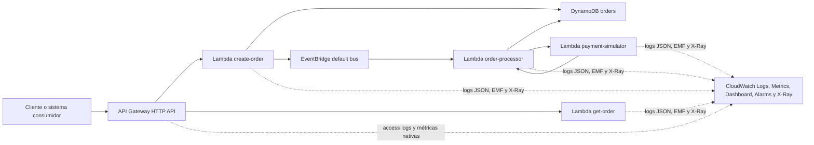
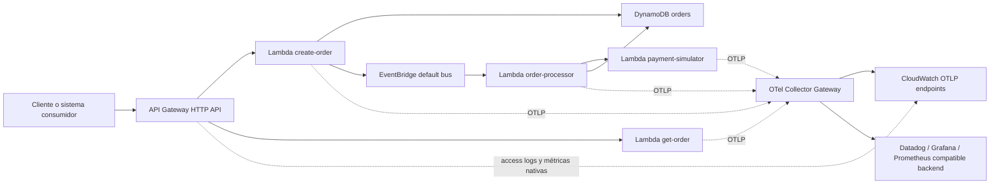

# Observability Business Case

Caso base para talleres técnicos senior sobre arquitectura serverless, resiliencia y observabilidad. Esta iteración mantiene el flujo funcional de procesamiento de órdenes y reemplaza la infraestructura SAM por Terraform para simplificar CI/CD y el control del estado de la infraestructura.

## Arquitectura

- Amazon API Gateway HTTP API expone `POST /orders` y `GET /orders/{orderId}`.
- Lambda `create-order` valida el payload, calcula `totalAmount`, persiste la orden en DynamoDB con estado `PENDING` y publica `OrderCreated` en EventBridge.
- Lambda `order-processor` consume el evento, mueve la orden a `PROCESSING`, invoca sincrónicamente al simulador de pago y actualiza el estado final.
- Lambda `payment-simulator` simula pagos con modos configurables para escenarios de falla.
- DynamoDB almacena el estado y atributos de la orden.
- CloudWatch Logs concentra logs JSON de cada Lambda y access logs del API.
- CloudWatch Metrics recibe métricas custom vía Embedded Metric Format (EMF) sin librerías adicionales.
- AWS X-Ray queda habilitado en las Lambdas para ver latencia y errores por función.
- Cuando `OTEL_EXPORT_STRATEGY=collector`, el deploy provisiona una suite en EC2 con Alloy como collector OTLP, Prometheus como backend de métricas, Tempo como backend de trazas, Grafana como visualizador y Loki como backend listo para logs.
- La base de instrumentación compartida vive en `src/shared/observability.js` y la convención del repositorio es `otel-first`, preservando compatibilidad temporal con EMF para CloudWatch.



### Arquitectura objetivo OTLP con Collector



## Observabilidad implementada

- Correlación end-to-end con `x-correlation-id`, `requestId`, `awsRequestId` y `orderId`.
- Propagación de `correlationId` desde `POST /orders` hacia EventBridge, `order-processor` y `payment-simulator`.
- Base de instrumentación OpenTelemetry en código, compatible con ADOT Lambda layer y con exporters OTLP cuando se configuren.
- Estrategia recomendada de salida OTLP: `Collector primero`, para desacoplar la instrumentación del backend final.
- Logs JSON consistentes por servicio con contexto reutilizable.
- Métricas EMF para creación de órdenes, lecturas, órdenes procesadas, errores y latencia del simulador de pago.
- Retención explícita de CloudWatch Logs configurable desde Terraform.
- Access logs para API Gateway HTTP API.
- Dashboard de CloudWatch con métricas técnicas y de negocio.
- Alarmas básicas para 5xx del API, errores del procesador y latencia del simulador de pago.
- Con `OTEL_EXPORT_STRATEGY=collector`, suite en EC2 con Grafana, Alloy, Prometheus, Tempo y Loki para visualizar métricas y trazas OTLP y dejar Loki listo para logs futuros.

### Métricas de negocio recolectadas

| Métrica | Servicio | Qué representa |
| :--- | :--- | :--- |
| `OrdersCreated` | `order-api` | Órdenes creadas exitosamente |
| `CreateOrderLatencyMs` | `order-api` | Latencia de `POST /orders` |
| `CreateOrderErrors` | `order-api` | Errores al crear órdenes |
| `OrdersRead` | `order-api` | Lecturas exitosas de órdenes |
| `OrdersNotFound` | `order-api` | Consultas de órdenes inexistentes |
| `GetOrderErrors` | `order-api` | Errores en `GET /orders/{orderId}` |
| `OrdersProcessed` | `order-processor` | Eventos procesados con resultado final |
| `PaymentInvocationLatencyMs` | `order-processor` | Latencia de la invocación al simulador de pago |
| `OrderProcessorIgnoredEvents` | `order-processor` | Eventos ignorados por payload inválido |
| `OrderProcessorDuplicateEvents` | `order-processor` | Eventos duplicados o ya procesados |
| `OrderProcessorErrors` | `order-processor` | Errores del procesador de órdenes |
| `PaymentsSimulated` | `payment-simulator` | Pagos simulados con estado final |
| `PaymentSimulationLatencyMs` | `payment-simulator` | Latencia del simulador de pago |
| `PaymentSimulationErrors` | `payment-simulator` | Errores del simulador de pago |

Notas:

- estas métricas se registran desde `src/shared/observability.js`
- con `OBSERVABILITY_EMF_COMPATIBILITY_MODE=true`, salen además por EMF hacia CloudWatch Metrics
- si OTLP está activo, los mismos nombres se exportan también por OpenTelemetry

Nota: esta solución usa API Gateway HTTP API. Esa variante no soporta tracing activo con X-Ray como sí ocurre con REST API, así que el API se observa mediante access logs; el tracing queda habilitado en las Lambdas.

## Estructura

```text
.
├── README.md
├── package.json
├── infra
│   └── terraform
│       ├── main.tf
│       ├── outputs.tf
│       └── variables.tf
├── scripts
│   ├── create-order.sh
│   ├── generate-load.sh
│   ├── get-order.sh
│   └── prepare-lambda-package.sh
└── src
    ├── order-api
    ├── order-processor
    ├── payment-simulator
    └── shared
```

## Requisitos

- Node.js 20.x
- Terraform CLI 1.6 o superior
- AWS CLI configurado con credenciales válidas

## Variables de despliegue

La guía completa de observabilidad, ADOT, OTLP, Collector, variables y casos de despliegue vive en:

- [Observability Deployment Guide](/Users/pazfernando/Documents/projects/windsurf/workshop-order-processing/docs/observability-deployment.md)
- [Deployment Profile](/Users/pazfernando/Documents/projects/windsurf/workshop-order-processing/docs/deployment-profile.md)

Resumen operativo corto:

- Default del repo hoy: `OTEL_MODE=code` y `OTEL_EXPORT_STRATEGY=direct`
- Arquitectura objetivo: `OTEL_MODE=code` y `OTEL_EXPORT_STRATEGY=collector`
- Si usas `adot_layer`, debes definir `ADOT_LAMBDA_LAYER_ARN`
- Si usas `adot_layer` en este repo Node.js, Terraform configura `AWS_LAMBDA_EXEC_WRAPPER=/opt/otel-handler`
- Si usas `OTEL_EXPORT_STRATEGY=collector`, Terraform provisiona la suite EC2 y, si no defines endpoints explícitos, infiere el endpoint HTTP de Alloy para trazas y métricas
- Si usas un endpoint base OTLP/HTTP con `OTEL_EXPORTER_OTLP_ENDPOINT` o `OTEL_COLLECTOR_ENDPOINT`, el SDK construye `.../v1/traces` y `.../v1/metrics`; no debes sobreescribir las variables por señal con la raíz desnuda `:4318`
- Si usas `direct` con `adot_layer` y no defines overrides, Terraform infiere CloudWatch OTLP por señal en la región actual
- Si usas `direct` con `code`, no apuntes a CloudWatch OTLP directo con este repo: los exporters en código no firman SigV4
- Si usas `collector`, en este repo debes mantener `OTEL_MODE=code` para que las métricas custom del negocio lleguen a Grafana/Alloy/Prometheus
- En `OTEL_MODE=code` + `collector`, este repo hace `forceFlush` de métricas al final de cada invocación Lambda para no depender solo del intervalo periódico del SDK
- Si usas `adot_layer`, Terraform adjunta `CloudWatchLambdaApplicationSignalsExecutionRolePolicy` a los execution roles de las Lambdas

### Matriz de soporte por combinación

| Combinación | Trazas | Métricas custom del negocio | Uso recomendado en este repo |
| :--- | :--- | :--- | :--- |
| `code + direct` | Sí | Sí, hacia OTLP genérico no-AWS | Backends OTLP directos no-AWS |
| `code + collector` | Sí | Sí, hacia Alloy/Prometheus/Grafana | Recomendado para la suite EC2; hace `forceFlush` por invocación |
| `adot_layer + direct` | Sí | Sí, para CloudWatch OTLP directo | Recomendado para CloudWatch directo |
| `adot_layer + collector` | Sí, potencialmente | No soportado en este repo | Bloqueado por deploy/Terraform |

### Inputs manuales de `deploy.yml`

| Input | Default | Cuándo cambiarlo |
| :--- | :--- | :--- |
| `resource_prefix` | `aws-dev-1` | Si quieres coexistir con varios despliegues del mismo stack en la misma cuenta/región |
| `payment_failure_mode` | `random_fail` | Para simular fallas o latencia en el workshop |
| `log_retention_in_days` | `7` | Si necesitas mayor o menor retención de logs |
| `metrics_namespace` | `Workshop/OrderProcessing` | Si quieres aislar métricas por ambiente o equipo |
| `otel_mode` | `code` | Déjalo en `code` para `collector`; usa `adot_layer` solo para CloudWatch OTLP directo |
| `adot_lambda_layer_arn` | vacío | Solo si quieres forzar un ARN distinto al inferido |
| `otel_export_strategy` | `direct` | Usa `collector` para provisionar y usar la suite EC2 del workshop |
| `otel_exporter_otlp_endpoint` | vacío | Para backends OTLP no-AWS con endpoint base único |
| `otel_exporter_otlp_traces_endpoint` | vacío | Para override directo de trazas |
| `otel_exporter_otlp_metrics_endpoint` | vacío | Para override directo de métricas |
| `otel_collector_endpoint` | vacío | Úsalo solo si quieres apuntar a un Collector distinto al Alloy inferido |
| `otel_collector_traces_endpoint` | vacío | Override de trazas hacia Collector; si es OTLP/HTTP debe incluir `/v1/traces` |
| `otel_collector_metrics_endpoint` | vacío | Override de métricas hacia Collector; si es OTLP/HTTP debe incluir `/v1/metrics` |
| `observability_emf_compatibility_mode` | `true` | Si quieres apagar EMF y quedarte solo con OTLP |
| `create_observability_dashboard` | `true` | Si no quieres crear dashboard CloudWatch |
| `create_observability_alarms` | `true` | Si no quieres crear alarmas CloudWatch |
| `observability_suite_instance_type` | `t3.small` | Si necesitas más CPU o memoria para la suite |

Estos son los inputs manuales expuestos por `workflow_dispatch`. Los thresholds de alarmas, `OTEL_METRIC_EXPORT_INTERVAL_MS`, `TF_STATE_BUCKET`, `TF_STATE_KEY` y `OBSERVABILITY_SUITE_GRAFANA_ADMIN_PASSWORD` siguen entrando desde GitHub environment/repository settings. Para el password de Grafana, usa `Secrets` como primera opción. `resource_prefix` también existe en `teardown.yml` para que puedas destruir exactamente el despliegue que elegiste crear.

Reglas importantes:

- `adot_layer + direct` con endpoints directos vacíos infiere `X-Ray` y `CloudWatch Metrics` por OTLP para la región actual
- ese camino requiere `SigV4`, usa `AWS_LAMBDA_EXEC_WRAPPER=/opt/otel-handler` y adjunta `CloudWatchLambdaApplicationSignalsExecutionRolePolicy`
- `code + direct` sirve para OTLP genérico, no para CloudWatch OTLP directo
- `code + collector` es la combinación soportada en este repo para métricas OTLP del negocio hacia Grafana/Alloy/Prometheus
- ese camino depende del bootstrap en código y de `forceFlush` por invocación para que Lambda no deje métricas en memoria sin exportar
- `adot_layer + collector` no está soportado en este repo para métricas custom del negocio y el deploy ahora lo bloquea
- `OTEL_EXPORT_STRATEGY=collector` provisiona y usa la suite EC2 automáticamente
- la suite en EC2 soporta hoy métricas OTLP hacia Prometheus y trazas OTLP hacia Tempo; Loki queda listo para logs OTLP futuros
- la suite en EC2 intenta usar primero una subnet pública de la región y, si no existe, cae a la primera subnet disponible
- si defines `OBSERVABILITY_SUITE_GRAFANA_ADMIN_PASSWORD` en GitHub `Secrets`, Grafana usará esa clave fija; si no existe, el workflow cae a `Variables` y luego a una aleatoria de Terraform

## Despliegue local

### 1. Configurar credenciales AWS

Puedes usar AWS CLI:

```bash
aws configure
```

O variables de entorno:

```bash
export AWS_ACCESS_KEY_ID="<tu-access-key-id>"
export AWS_SECRET_ACCESS_KEY="<tu-secret-access-key>"
export AWS_REGION="us-east-1"
```

### 2. Configurar variables de despliegue

```bash
export STACK_NAME="observability-business-case"
export RESOURCE_PREFIX="aws-dev-1"
export AWS_REGION="us-east-1"
export PAYMENT_FAILURE_MODE="random_fail"
export LOG_RETENTION_IN_DAYS="7"
export METRICS_NAMESPACE="Workshop/OrderProcessing"
export OTEL_MODE="code"
export OTEL_EXPORT_STRATEGY="direct"
export OTEL_COLLECTOR_ENDPOINT=""
export OTEL_COLLECTOR_TRACES_ENDPOINT=""
export OTEL_COLLECTOR_METRICS_ENDPOINT=""
export ADOT_LAMBDA_LAYER_ARN=""
export OTEL_EXPORTER_OTLP_ENDPOINT=""
export OTEL_EXPORTER_OTLP_TRACES_ENDPOINT=""
export OTEL_EXPORTER_OTLP_METRICS_ENDPOINT=""
export OTEL_METRIC_EXPORT_INTERVAL_MS="10000"
export OBSERVABILITY_EMF_COMPATIBILITY_MODE="true"
export CREATE_OBSERVABILITY_DASHBOARD="true"
export CREATE_OBSERVABILITY_ALARMS="true"
export OBSERVABILITY_SUITE_INSTANCE_TYPE="t3.small"
export OBSERVABILITY_SUITE_ROOT_VOLUME_SIZE_GB="20"
export OBSERVABILITY_SUITE_GRAFANA_ALLOWED_CIDRS='["0.0.0.0/0"]'
export OBSERVABILITY_SUITE_OTLP_ALLOWED_CIDRS='["0.0.0.0/0"]'
export API_5XX_ALARM_THRESHOLD="1"
export ORDER_PROCESSOR_ERROR_ALARM_THRESHOLD="1"
export PAYMENT_LATENCY_ALARM_THRESHOLD_MS="3000"
```

Si quieres mantener estado remoto también localmente:

```bash
export TF_STATE_BUCKET="<tu-bucket-terraform-state>"
export TF_STATE_KEY="aws-dev/aws-dev-1-observability-business-case.tfstate"
```

### 3. Instalar dependencias y empaquetar Lambda

```bash
npm install
bash scripts/prepare-lambda-package.sh
```

### 4. Inicializar Terraform

Si usas estado remoto:

```bash
terraform -chdir=infra/terraform init -reconfigure \
  -backend-config="bucket=${TF_STATE_BUCKET}" \
  -backend-config="key=${TF_STATE_KEY:-aws-dev/${RESOURCE_PREFIX}-${STACK_NAME}.tfstate}" \
  -backend-config="region=${AWS_REGION}"
```

Si trabajas localmente sin backend remoto:

```bash
terraform -chdir=infra/terraform init -backend=false
```

### 5. Aplicar infraestructura

```bash
terraform -chdir=infra/terraform apply \
  -var="aws_region=${AWS_REGION}" \
  -var="stack_name=${STACK_NAME}" \
  -var="resource_prefix=${RESOURCE_PREFIX}" \
  -var="payment_failure_mode=${PAYMENT_FAILURE_MODE}" \
  -var="log_retention_in_days=${LOG_RETENTION_IN_DAYS}" \
  -var="metrics_namespace=${METRICS_NAMESPACE}" \
  -var="otel_mode=${OTEL_MODE}" \
  -var="otel_export_strategy=${OTEL_EXPORT_STRATEGY}" \
  -var="otel_collector_endpoint=${OTEL_COLLECTOR_ENDPOINT}" \
  -var="otel_collector_traces_endpoint=${OTEL_COLLECTOR_TRACES_ENDPOINT}" \
  -var="otel_collector_metrics_endpoint=${OTEL_COLLECTOR_METRICS_ENDPOINT}" \
  -var="adot_lambda_layer_arn=${ADOT_LAMBDA_LAYER_ARN}" \
  -var="otel_exporter_otlp_endpoint=${OTEL_EXPORTER_OTLP_ENDPOINT}" \
  -var="otel_exporter_otlp_traces_endpoint=${OTEL_EXPORTER_OTLP_TRACES_ENDPOINT}" \
  -var="otel_exporter_otlp_metrics_endpoint=${OTEL_EXPORTER_OTLP_METRICS_ENDPOINT}" \
  -var="otel_metric_export_interval_ms=${OTEL_METRIC_EXPORT_INTERVAL_MS}" \
  -var="observability_emf_compatibility_mode=${OBSERVABILITY_EMF_COMPATIBILITY_MODE}" \
  -var="create_observability_dashboard=${CREATE_OBSERVABILITY_DASHBOARD}" \
  -var="create_observability_alarms=${CREATE_OBSERVABILITY_ALARMS}" \
  -var="observability_suite_instance_type=${OBSERVABILITY_SUITE_INSTANCE_TYPE}" \
  -var="observability_suite_root_volume_size_gb=${OBSERVABILITY_SUITE_ROOT_VOLUME_SIZE_GB}" \
  -var="observability_suite_grafana_allowed_cidrs=${OBSERVABILITY_SUITE_GRAFANA_ALLOWED_CIDRS}" \
  -var="observability_suite_otlp_allowed_cidrs=${OBSERVABILITY_SUITE_OTLP_ALLOWED_CIDRS}" \
  -var="api_5xx_alarm_threshold=${API_5XX_ALARM_THRESHOLD}" \
  -var="order_processor_error_alarm_threshold=${ORDER_PROCESSOR_ERROR_ALARM_THRESHOLD}" \
  -var="payment_latency_alarm_threshold_ms=${PAYMENT_LATENCY_ALARM_THRESHOLD_MS}"
```

### 6. Obtener la URL del API

```bash
terraform -chdir=infra/terraform output -raw api_base_url
```

Exporta la URL:

```bash
export API_BASE_URL="$(terraform -chdir=infra/terraform output -raw api_base_url)"
```

Las rutas operativas son `${API_BASE_URL}/orders` y `${API_BASE_URL}/orders/{orderId}`.

## Destruir infraestructura

```bash
terraform -chdir=infra/terraform destroy \
  -var="aws_region=${AWS_REGION}" \
  -var="stack_name=${STACK_NAME}" \
  -var="resource_prefix=${RESOURCE_PREFIX}" \
  -var="payment_failure_mode=${PAYMENT_FAILURE_MODE}" \
  -var="log_retention_in_days=${LOG_RETENTION_IN_DAYS}" \
  -var="metrics_namespace=${METRICS_NAMESPACE}" \
  -var="otel_mode=${OTEL_MODE}" \
  -var="otel_export_strategy=${OTEL_EXPORT_STRATEGY}" \
  -var="otel_collector_endpoint=${OTEL_COLLECTOR_ENDPOINT}" \
  -var="otel_collector_traces_endpoint=${OTEL_COLLECTOR_TRACES_ENDPOINT}" \
  -var="otel_collector_metrics_endpoint=${OTEL_COLLECTOR_METRICS_ENDPOINT}" \
  -var="adot_lambda_layer_arn=${ADOT_LAMBDA_LAYER_ARN}" \
  -var="otel_exporter_otlp_endpoint=${OTEL_EXPORTER_OTLP_ENDPOINT}" \
  -var="otel_exporter_otlp_traces_endpoint=${OTEL_EXPORTER_OTLP_TRACES_ENDPOINT}" \
  -var="otel_exporter_otlp_metrics_endpoint=${OTEL_EXPORTER_OTLP_METRICS_ENDPOINT}" \
  -var="otel_metric_export_interval_ms=${OTEL_METRIC_EXPORT_INTERVAL_MS}" \
  -var="observability_emf_compatibility_mode=${OBSERVABILITY_EMF_COMPATIBILITY_MODE}" \
  -var="create_observability_dashboard=${CREATE_OBSERVABILITY_DASHBOARD}" \
  -var="create_observability_alarms=${CREATE_OBSERVABILITY_ALARMS}" \
  -var="observability_suite_instance_type=${OBSERVABILITY_SUITE_INSTANCE_TYPE}" \
  -var="observability_suite_root_volume_size_gb=${OBSERVABILITY_SUITE_ROOT_VOLUME_SIZE_GB}" \
  -var="observability_suite_grafana_allowed_cidrs=${OBSERVABILITY_SUITE_GRAFANA_ALLOWED_CIDRS}" \
  -var="observability_suite_otlp_allowed_cidrs=${OBSERVABILITY_SUITE_OTLP_ALLOWED_CIDRS}" \
  -var="api_5xx_alarm_threshold=${API_5XX_ALARM_THRESHOLD}" \
  -var="order_processor_error_alarm_threshold=${ORDER_PROCESSOR_ERROR_ALARM_THRESHOLD}" \
  -var="payment_latency_alarm_threshold_ms=${PAYMENT_LATENCY_ALARM_THRESHOLD_MS}"
```

## CI/CD con GitHub Actions

El repositorio incluye tres workflows:

- [ci.yml](/Users/pazfernando/Documents/projects/windsurf/workshop-order-processing/.github/workflows/ci.yml): valida sintaxis JavaScript, empaqueta Lambda y ejecuta `terraform fmt` y `terraform validate`
- [deploy.yml](/Users/pazfernando/Documents/projects/windsurf/workshop-order-processing/.github/workflows/deploy.yml): despliega automáticamente a AWS solo cuando hay push a `main`; ramas como `dev` usan `workflow_dispatch`
- [teardown.yml](/Users/pazfernando/Documents/projects/windsurf/workshop-order-processing/.github/workflows/teardown.yml): destruye manualmente la infraestructura con `terraform destroy` usando el mismo backend remoto

### Secrets y variables requeridos en GitHub

Secrets:

- `AWS_ACCESS_KEY_ID`
- `AWS_SECRET_ACCESS_KEY`
- `AWS_SESSION_TOKEN` si usas credenciales temporales de STS

Variables:

- `AWS_REGION`
- `STACK_NAME`
- `RESOURCE_PREFIX` opcional
- `PAYMENT_FAILURE_MODE`
- `LOG_RETENTION_IN_DAYS` opcional
- `METRICS_NAMESPACE` opcional
- `OTEL_MODE` opcional
- `OTEL_EXPORT_STRATEGY` opcional
- `OTEL_COLLECTOR_ENDPOINT` opcional; si queda vacío con `OTEL_EXPORT_STRATEGY=collector`, Terraform infiere Alloy
- `OTEL_COLLECTOR_TRACES_ENDPOINT` opcional
- `OTEL_COLLECTOR_METRICS_ENDPOINT` opcional
- `ADOT_LAMBDA_LAYER_ARN` opcional salvo que `OTEL_MODE=adot_layer`
- `OTEL_EXPORTER_OTLP_ENDPOINT` opcional
- `OTEL_EXPORTER_OTLP_TRACES_ENDPOINT` opcional
- `OTEL_EXPORTER_OTLP_METRICS_ENDPOINT` opcional
- `OTEL_METRIC_EXPORT_INTERVAL_MS` opcional
- `OBSERVABILITY_EMF_COMPATIBILITY_MODE` opcional
- `CREATE_OBSERVABILITY_DASHBOARD` opcional
- `CREATE_OBSERVABILITY_ALARMS` opcional
- `OBSERVABILITY_SUITE_INSTANCE_TYPE` opcional
- `OBSERVABILITY_SUITE_ROOT_VOLUME_SIZE_GB` opcional
- `OBSERVABILITY_SUITE_GRAFANA_ALLOWED_CIDRS` opcional
- `OBSERVABILITY_SUITE_OTLP_ALLOWED_CIDRS` opcional
- `API_5XX_ALARM_THRESHOLD` opcional
- `ORDER_PROCESSOR_ERROR_ALARM_THRESHOLD` opcional
- `PAYMENT_LATENCY_ALARM_THRESHOLD_MS` opcional
- `TF_STATE_KEY` opcional

Reglas para `direct`:

- con `OTEL_MODE=adot_layer`, dejar vacíos los endpoints directos hace que Terraform infiera `https://xray.<region>.amazonaws.com/v1/traces` y `https://monitoring.<region>.amazonaws.com/v1/metrics`
- esos endpoints de CloudWatch requieren `SigV4`
- en este repo Node.js, ese camino usa `/opt/otel-handler`
- Terraform adjunta `CloudWatchLambdaApplicationSignalsExecutionRolePolicy` cuando `OTEL_MODE=adot_layer`
- `code + direct` no debe apuntar a CloudWatch OTLP directo
- con `OTEL_EXPORT_STRATEGY=collector`, si no defines `OTEL_COLLECTOR_TRACES_ENDPOINT` ni `OTEL_COLLECTOR_METRICS_ENDPOINT`, Terraform infiere el endpoint OTLP HTTP de Alloy
- la suite provisiona `Grafana + Alloy + Prometheus + Tempo + Loki` en una sola EC2 para workshops

### Backend remoto de Terraform en GitHub Actions

En GitHub Actions el backend remoto no es opcional. El runner es efímero, así que el workflow asegura un bucket S3 para el estado antes de ejecutar `terraform init`.

Si `TF_STATE_BUCKET` no está definido, el workflow crea uno automáticamente en la cuenta destino con este patrón:

- `${resource_prefix}-${stack_name}-${account_id}-${aws_region}-tfstate`

Si ese nombre excede el límite de 63 caracteres de S3, el workflow lo recorta de forma determinística y agrega un hash corto para mantener unicidad.

Luego usa una key por environment y prefijo efectivo:

- `${environment}/${RESOURCE_PREFIX}-${STACK_NAME}.tfstate`

En este repositorio, para el environment `aws-dev`, la key por defecto queda:

- `aws-dev/aws-dev-1-observability-business-case.tfstate`

Y los recursos nombrados quedan con este patrón:

- `${RESOURCE_PREFIX}-${STACK_NAME}-...`

### Flujo de despliegue

1. Crear un branch y abrir Pull Request.
2. GitHub Actions ejecuta `CI`.
3. Al hacer merge a `main`, GitHub Actions ejecuta `Deploy`.
4. El workflow empaqueta la app, ejecuta `terraform init` y luego `terraform apply`.
5. Al final imprime `api_base_url` desde Terraform.

## Collector recomendado

El repositorio incluye dos configuraciones de referencia para el Collector en [infra/otel-collector](/Users/pazfernando/Documents/projects/windsurf/workshop-order-processing/infra/otel-collector):

- [collector-cloudwatch.yaml](/Users/pazfernando/Documents/projects/windsurf/workshop-order-processing/infra/otel-collector/collector-cloudwatch.yaml): enruta métricas y trazas OTLP hacia CloudWatch
- [collector-cloudwatch-third-party.yaml](/Users/pazfernando/Documents/projects/windsurf/workshop-order-processing/infra/otel-collector/collector-cloudwatch-third-party.yaml): fan-out a CloudWatch y a un backend OTLP adicional

Estas configuraciones aplican:

- `memory_limiter` y `batch` para proteger el Collector
- `filter/health` para sacar tráfico sanitario
- `attributes/sanitize` para eliminar atributos de alta cardinalidad o sensibles
- `tail_sampling` para priorizar errores y trazas lentas antes de exportar a CloudWatch o terceros

Importante:

- El workflow del repositorio usa `direct` como default operativo.
- Cambia a `collector` cuando quieras usar la suite EC2 del workshop o cuando ya tengas un Collector externo real.

Ejemplo de despliegue apuntando al Collector:

```bash
export OTEL_EXPORT_STRATEGY="collector"
export OTEL_COLLECTOR_ENDPOINT="http://collector.internal:4318"
terraform -chdir=infra/terraform apply \
  -var="aws_region=${AWS_REGION}" \
  -var="stack_name=${STACK_NAME}" \
  -var="resource_prefix=${RESOURCE_PREFIX}" \
  -var="payment_failure_mode=${PAYMENT_FAILURE_MODE}" \
  -var="log_retention_in_days=${LOG_RETENTION_IN_DAYS}" \
  -var="metrics_namespace=${METRICS_NAMESPACE}" \
  -var="otel_mode=${OTEL_MODE}" \
  -var="otel_export_strategy=${OTEL_EXPORT_STRATEGY}" \
  -var="otel_collector_endpoint=${OTEL_COLLECTOR_ENDPOINT}" \
  -var="observability_emf_compatibility_mode=${OBSERVABILITY_EMF_COMPATIBILITY_MODE}"
```

### Teardown manual

El workflow `Teardown` solo corre por `workflow_dispatch` y exige escribir el `STACK_NAME` exacto como confirmación.

Destruye los recursos Terraform, pero no elimina el bucket S3 del backend ni el objeto del `tfstate`.

## Permisos IAM mínimos sugeridos para el usuario de despliegue

El usuario o credencial usada en GitHub Actions debe poder operar al menos con:

- S3 para backend de estado de Terraform
- IAM
- Lambda
- API Gateway v2
- DynamoDB
- EventBridge
- CloudWatch Logs

## Probar el flujo

Crear una orden:

```bash
bash scripts/create-order.sh
```

Ejemplo `curl`:

```bash
curl -X POST "${API_BASE_URL}/orders" \
  -H "content-type: application/json" \
  -H "x-correlation-id: demo-001" \
  --data '{
    "customerId": "customer-001",
    "items": [
      {
        "sku": "SKU-001",
        "quantity": 2,
        "unitPrice": 25.5
      }
    ],
    "currency": "USD"
  }'
```

## Qué observar en AWS

- CloudWatch Logs:
  - [infra/terraform/main.tf](/Users/pazfernando/Documents/projects/windsurf/workshop-order-processing/infra/terraform/main.tf) crea log groups dedicados para cada Lambda y para el access log del API.
  - Busca `correlationId`, `requestId` y `orderId` para seguir la ejecución completa.
- CloudWatch Metrics:
  - Namespace por defecto: `Workshop/OrderProcessing`
  - Métricas esperadas: `OrdersCreated`, `OrdersProcessed`, `OrderProcessorErrors`, `PaymentSimulationLatencyMs`, `CreateOrderLatencyMs`
- CloudWatch Dashboard:
  - Terraform crea un dashboard llamado `${RESOURCE_PREFIX}-${STACK_NAME}-observability` cuando `CREATE_OBSERVABILITY_DASHBOARD=true`.
  - Resume tráfico del API, errores, latencia, métricas Lambda y métricas de negocio.
- CloudWatch Alarms:
  - `${RESOURCE_PREFIX}-${STACK_NAME}-api-5xx`
  - `${RESOURCE_PREFIX}-${STACK_NAME}-order-processor-errors`
  - `${RESOURCE_PREFIX}-${STACK_NAME}-payment-latency`
- X-Ray:
  - Revisa los traces de las Lambdas `create-order`, `get-order`, `order-processor` y `payment-simulator`.
  - El API no emite traces X-Ray por ser HTTP API; usa el access log para ese borde.

Respuesta esperada:

```json
{
  "orderId": "generated-id",
  "status": "PENDING"
}
```

Consultar una orden:

```bash
bash scripts/get-order.sh <orderId>
```

Ejemplo `curl`:

```bash
curl "${API_BASE_URL}/orders/<orderId>"
```

## Comandos útiles

- Instalar dependencias: `npm install`
- Verificación rápida: `npm run check`
- Empaquetar Lambda: `npm run package:lambda`
- Formatear/verificar Terraform: `npm run terraform:fmt`
- Validar Terraform: `npm run terraform:validate`
